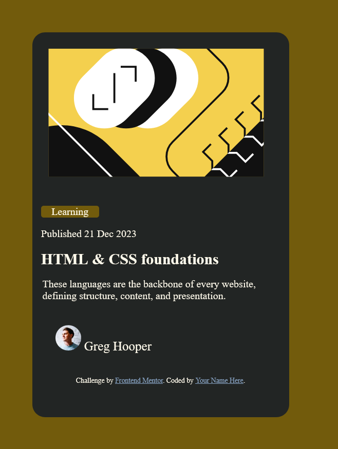

# Frontend Mentor - Blog preview card solution

This is a solution to the [Blog preview card challenge on Frontend Mentor](https://www.frontendmentor.io/challenges/blog-preview-card-ckPaj01IcS). Frontend Mentor challenges help you improve your coding skills by building realistic projects. 

## Table of contents

- [Overview](#overview)
  - [The challenge](#the-challenge)
  - [Screenshot](#screenshot)
  - [Links](#links)
- [My process](#my-process)
  - [Built with](#built-with)
  - [Continued development](#continued-development)
  - [Useful resources](#useful-resources)
- [Author](#author)

## Overview
my attempt to complete the challenge
### The challenge

Users should be able to:

- See hover and focus states for all interactive elements on the page

### Screenshot



### Links

- Solution URL: [solution URL here](https://github.com/nightfoxstarfox/blog-preview-card)
- Live Site URL: [live site URL here](https://nightfoxstarfox.github.io/blog-preview-card/)

## My process

### Built with
- html and css


### What I learned

I didn't learn much, but I discovered a little more about the usefulness of margin and padding, like:

```css
.Learning{
  background:hsl(47, 88%, 63%);
  width: 90px;
  margin: 14px;
  border-radius: 4px;
}
```

### Continued development

I will continue training some things that I know, like margin and centralization tags like display:flex


## Author

- Website - [nightfoxstarfox](https://www.your-site.com)
- Frontend Mentor - [@wtfbaby](https://www.frontendmentor.io/profile/yourusername)
- Twitter - [none](#)
